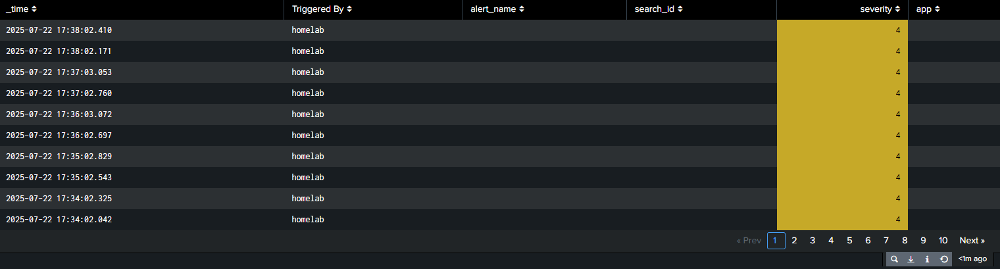

# Splunk SOC Lab: Ubuntu Server & Kali Linux Simulation
[](https://www.linkedin.com/in/salman-al-mutairi-305s/) [](https://github.com/R0salman/splunk-homelab-siem)

This repository demonstrates my practical expertise in Security Operations Center (SOC) methodologies and Splunk Enterprise. It outlines the successful design, implementation, and analysis within a simulated lab environment, showcasing capabilities in:

- Log collection
- Detection engineering
- Incident alerting

## Lab Environment

This project simulates a mini SOC environment, highlighting my proficiency in deploying and configuring key cybersecurity tools to monitor and respond to simulated threats.

- **Ubuntu Server**: Monitored endpoint for log generation  
- **Kali Linux**: Simulates adversary behaviors (e.g., SSH brute-force attacks)  
- **Splunk Enterprise**: Centralized log analysis and alerting platform

### Core Splunk Capabilities Demonstrated:

- **Log Ingestion & Normalization**  
- **Dashboard Development**  
- **Detection Engineering (SPL Queries)**  
- **Severity-based Alerting & Incident Response**

---

## Technical Architecture & Workflow

This section illustrates the robust architecture I implemented for end-to-end security monitoring.


---

##  Key Achievements & Skill Demonstrations

- **Real-time SSH brute-force attack detection**
- **Advanced alerting for privileged account brute-force (e.g., root logins)**
- **Data Visualization with Splunk Dashboards**:
  - Failed SSH login trends
  - Top attacker IPs/usernames
  - Triggered alert logs
  - Geographical source IP mapping
  - System behavior timelines (reboots, CRON, services)

- **Log Management Pipeline** with `rsyslog`
- **Custom SPL Query Development** for intelligent severity classification

---

## Detection Engineering & Alerting Logic

Implemented alert rules and severity classification to identify and prioritize critical threats.



---

## Setup & Configuration (Technical Deep Dive)

### 1. Ubuntu Syslog Forwarding
```bash
sudo apt install rsyslog
sudo systemctl enable rsyslog

# Edit /etc/rsyslog.conf or /etc/rsyslog.d/50-default.conf:
# *.* @<splunk_ip>:514

sudo systemctl restart rsyslog
```

### 2. Ubuntu SSH Server Setup
```bash
sudo apt install openssh-server
sudo systemctl start ssh
```

### 3. Kali Linux Attack Simulation
```bash
hydra -l root -P /usr/share/wordlists/rockyou.txt ssh://<ubuntu_ip>
```

### 4. Splunk Enterprise Configuration
- Configured UDP 514 syslog input
- Created custom indexes
- Developed dashboards and alerts using SPL

## Future Enhancements & Continued Learning
- Integrate auditd and file integrity monitoring
- Simulate advanced persistent threats (APTs) (e.g., privilege escalation)
- Correlate attacker behavior across diverse logs
- Add external threat intelligence feeds (e.g., IP reputation enrichment)
